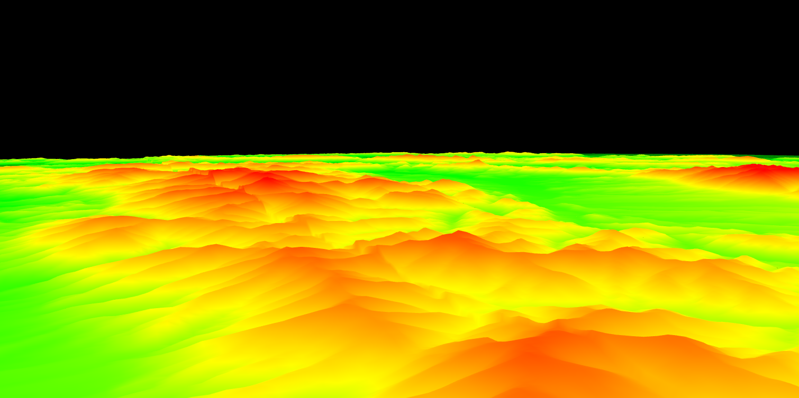

# Tren - SRTM Terrain Renderer: 




## Usage:

```sh
./Tren [data-directory]
```

### Optional:
```sh
-lon [start] [end]
-lat [start] [end]
-start [lon] [lat] [height]
```

### Example usage:  

```sh
./Tren ./data/M34/ -start 20 48 10
```


## Movement 

### 2D: 

- Arrow keys -> 2D movement on x and y axis
- Keypad +/- -> Zoom in/out


### 3D: 
Observer moves on the planet, at a fixed altitude (can be adjusted)

- wasd -> Moves observer -> relative to lon i lat
- LShift/Space -> Increase/Decrease height (relative to the center of the earth)
- Mouse -> rotations


## Controll:
- Left Bracket ("[") -> Switch to 3D
- Right Bracket ("]") -> Switch to 2D
- "0" -> Auto LOD
- "1-5" -> Adjust  LOD


## Get HGT files: 

[Coverage Maps](https://www.viewfinderpanoramas.org/Coverage%20map%20viewfinderpanoramas_org3.htm)


## Dependencies

```
libglm-dev
libglfw3
libglfw3-dev
libepoxy-dev
```